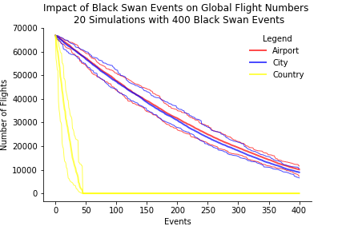

# Project 1: Monte Carlo Airports

Insights from a Black Swan Event Monte Carlo Simulation on International Flight Numbers

## Executive Summary¶

A Black Swan Monte Carlo experiment was performed on international flight data to see how removing random airports, cities and countries would affect overall flight numbers and what information would emerge from the data. Firstly, data was obtained from OpenFlights and cleaned. Following this exploratory data analysis was performed, some of the key insights were as follows:

- Airports and cities are heavily clustered under 2000 flights. Countries have a more even distribution, with most under approximately 3000.
- In each category it appears that there is one to three outliers in each category, the US appears in the outliers in all three.
- All of the top cities are in the top 10 countries except for Istanbul.

Following this, a Monte Carlo experiment was performed on all three categories, yielding the following insights:

- Countries bottomed out just below 50 events with quite a wide distribution between minimum and maximum.
- Initially airports and cities were closely connected with overlapping values. However, after approximately 200 events, the two diverged with a small but stable difference.

